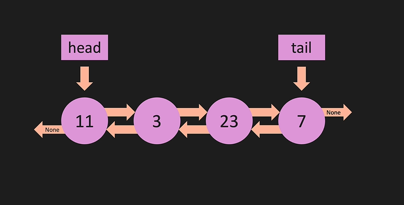

# Doubly LinkedList

A Doubly LinkedList is a type of linked list in which each node contains a reference to the next node as well as the previous node in the sequence. This allows for more efficient operations at the cost of increased complexity and memory usage.

## Diagram

## Structure

Each node in a Doubly LinkedList contains three fields:

1. `value`: The data stored in the node.
2. `next`: A reference to the next node in the list.
3. `prev`: A reference to the previous node in the list.

The Doubly LinkedList itself has a `head` and a `tail`, which point to the first and last node of the list, respectively.

## Operations

Doubly LinkedLists support several operations, including but not limited to:

- `append`: Add a new node to the end of the list.
- `prepend`: Add a new node to the start of the list.
- `insert`: Add a new node at a specific position in the list.
- `remove`: Remove a node from the list.
- `print_list`: Print the values of all nodes in the list.

## Complexity

Here are the time complexities for common operations on a Doubly LinkedList:

- Access: O(n)
- Search: O(n)
- Insertion: O(1)
- Deletion: O(1)

Note: The above complexities are for the worst-case scenarios.