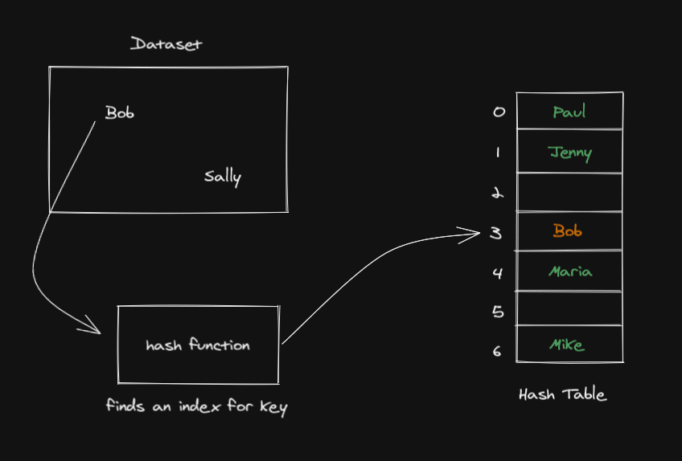

DSA
# Hash Table

A Hash Table is a data structure that implements an associative array abstract data type, a structure that can map keys to values. Hash tables use a hash function to compute an index into an array of buckets or slots, from which the desired value can be found.

## Diagram



## Structure

A Hash Table in Python is usually implemented as an array of lists (buckets). Each key is processed through a hash function which generates an index. This index decides which bucket the key-value pair is stored in.

## Operations

Hash Tables support several operations, including but not limited to:

- `insert`: Add a new key-value pair to the table.
- `search`: Check if a key exists in the table and retrieve the associated value.
- `delete`: Remove a key-value pair from the table.

## Complexity

Here are the time complexities for common operations on a Hash Table:

- Access: O(1)
- Search: O(1)
- Insertion: O(1)
- Deletion: O(1)

Note: The above complexities are for the average case. In the worst case (when a hash collision occurs), the complexity of these operations can degrade to O(n).

## Code Example

Here is a simple example of a Hash Table in Python:

```python
class HashTable:
    def __init__(self, size = 7):
        self.data_map = [None] * size
        
    def __hash(self, key):
        my_hash = 0
        for letter in key:
            my_hash = (my_hash + ord(letter) * 23) % len(self.data_map)
        return my_hash
    
    def print_table(self):
        for i, val in enumerate(self.data_map):
            print(i, ": ", val)