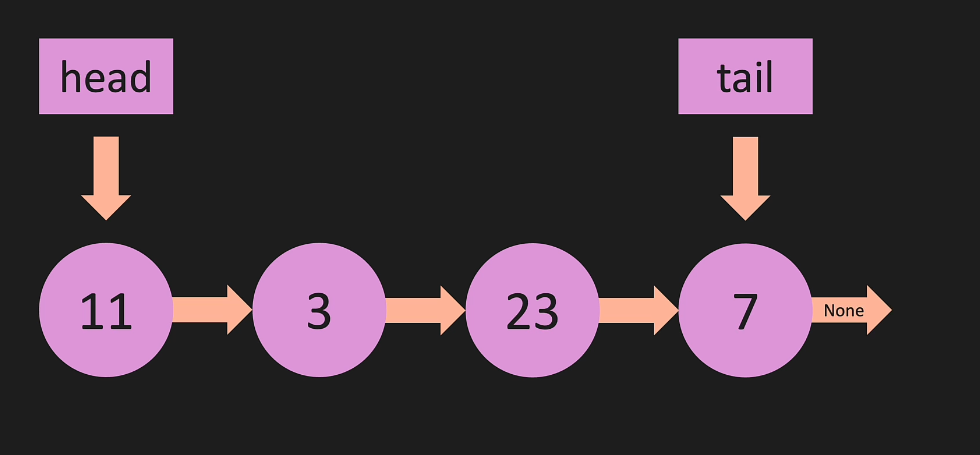

# LinkedList

A LinkedList is a type of linear data structure where each element is a separate object. Each element (node) of a list is comprising of two items - the data and a reference to the next node. The last node has a reference to null. The entry point into a linked list is called the head of the list.

## Diagram

## Structure

Each node in a LinkedList contains two fields:

1. `value`: The data stored in the node.
2. `next`: A reference to the next node in the list.

The LinkedList itself has a `head` and a `tail`, which point to the first and last node of the list, respectively.

## Operations

LinkedLists support several operations, including but not limited to:

- `append()`: Add a new node to the end of the list.
- `prepend()`: Add a new node to the start of the list.
- `insert()`: Add a new node at a specific position in the list.
- `remove()`: Remove a node from the list.
- `print_list()`: Print the values of all nodes in the list.
- `pop_first()`: Delete the first item in the list.
- `get()`: Get the item(node) in the list by index.

## Complexity

Here are the time complexities for common operations on a LinkedList:

- Access: O(n)
- Search: O(n)
- Insertion: O(1)
- Deletion: O(1)

Note: The above complexities are for the worst-case scenarios.