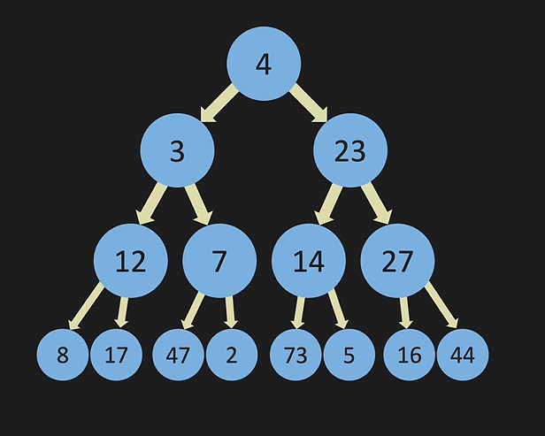

# Binary Search Tree

A Binary Search Tree (BST) is a tree data structure in which each node has at most two children, referred to as the left child and the right child. For each node, all elements in the left subtree are less than the node, and all elements in the right subtree are greater. This means that everything on the right of a node is bigger than the node and everything on the left is smaller.

## Diagram

## Structure

Each node in a Binary Search Tree contains three fields:

1. `value`: The data stored in the node.
2. `left`: A reference to the left child node.
3. `right`: A reference to the right child node.

The Binary Search Tree has a `root` which points to the topmost node in the tree.

## Operations

Binary Search Trees support several operations, including but not limited to:

- `insert`: Add a new node to the tree.
- `search`: Check if a value exists in the tree.
- `delete`: Remove a node from the tree.
- `traverse`: Visit all nodes in the tree in a specific order.

## Complexity

Here are the time complexities for common operations on a Binary Search Tree:

- Access: O(log n)
- Search: O(log n)
- Insertion: O(log n)
- Deletion: O(log n)

Note: The above complexities are for the average case. In the worst case (when the tree becomes skewed), the complexity of these operations can degrade to O(n).